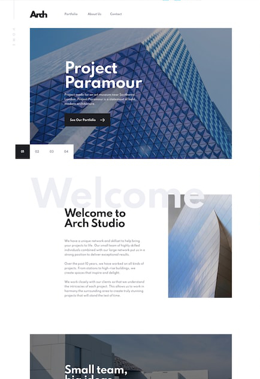
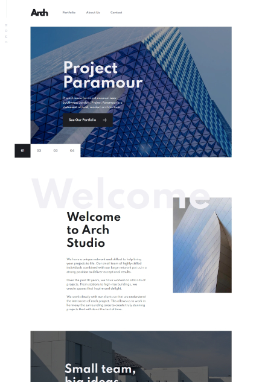

# Arch Studio

## Le projet

C'est un site multi-page qui respecte le design fournis par [front-end mentor](https://www.frontendmentor.io/). Mon but était de réaliser un site le plus proche possible de la consigne.

## Comparaison

### Consigne

### Resultat

## Visitez le site

https://arch-studio.herokuapp.com

## Le stack

Back-end : EJS / Node.js / Express 

Front-end : Sass